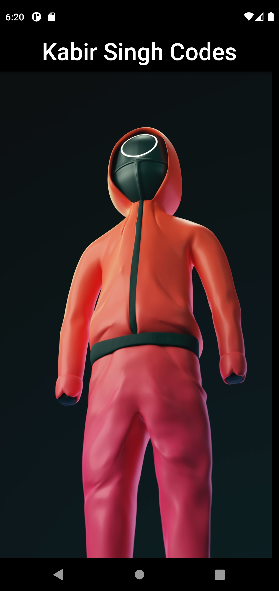
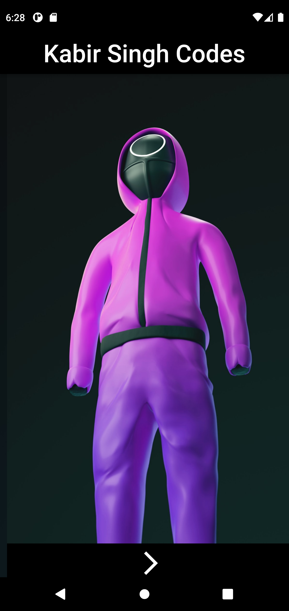
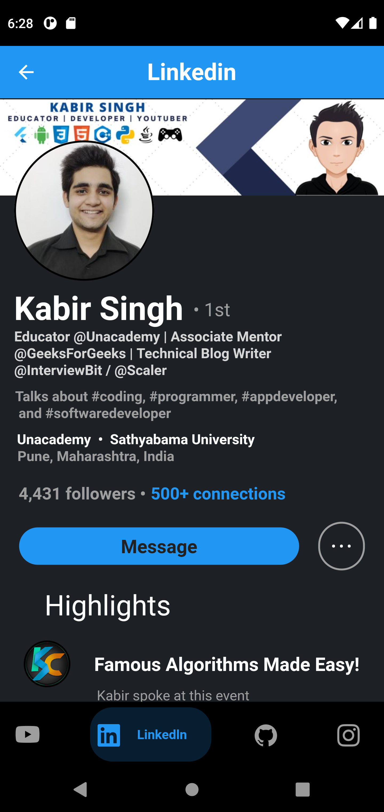
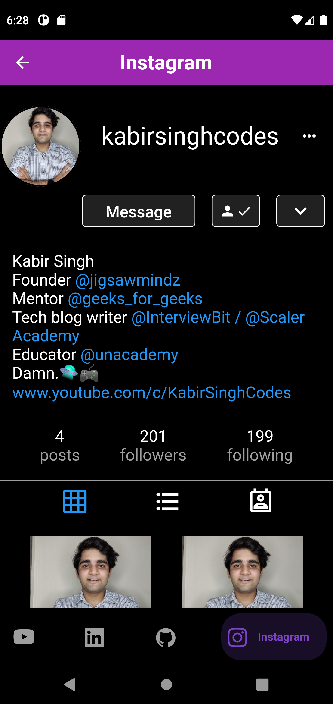

# KABIR SINGH CODES
A Flutter application that includes clones of 4 different social media handles and a breif knowledge to ME :-)

# Inspiration
Just a fun application that is a replica of all my social media accounts and is a one step information package too.

# What it does

It starts up with a cool squid games UI and takes you towards the main application which consists of four different clones

The clones are as follows

# YOUTUBE

# LINKEDIN

# GITHUB

# INSTAGRAM

# How I built it

This application is created using flutter and dart. 

# Connect With ME
LinkedIn : https://www.linkedin.com/in/kabirsinghcodes/
Instagram : https://www.instagram.com/kabirsinghcodes/
Github : https://github.com/kabirsinghcodes
Youtube : https://www.youtube.com/c/KabirSinghCodes
